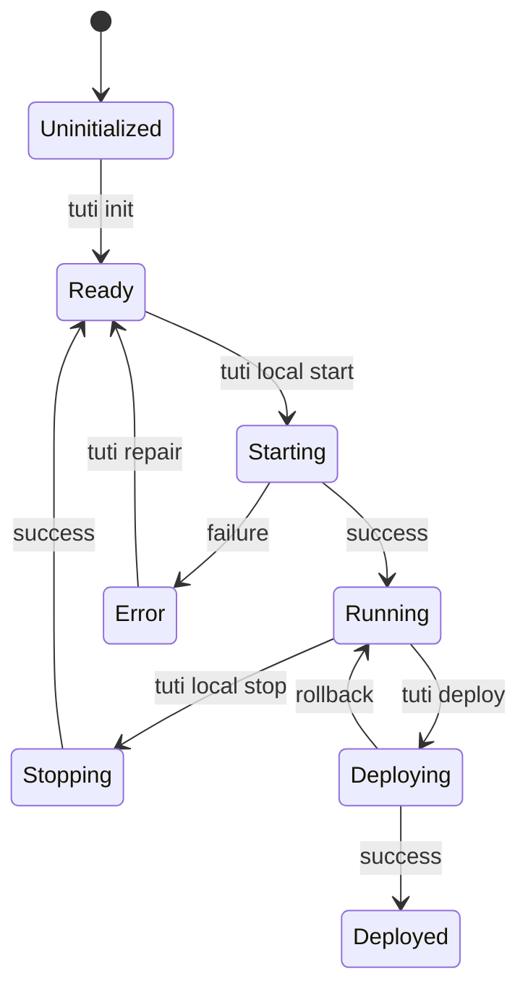

# Tuti CLI - Architecture & Feature Specification

> **Living Document** - Update this when adding new features or changing design.
> 
> **Last Updated:** 2025-12-15

---

## 🎯 Vision

**Tuti** = Total Universal Tool Infrastructure

One CLI for the entire development lifecycle: local development → staging → production.

**Key Differentiators vs Lando/DDEV/Spin:**
- ✅ Production deployment (not just local)
- ✅ Multi-project management from anywhere
- ✅ Intelligent port allocation across projects
- ✅ Single binary distribution

---

## 🧭 Core Concepts

### Two Operating Modes

```
┌─────────────────────────────────────────────────────────────┐
│                      GLOBAL MODE                            │
│  Run from anywhere: tuti projects:list, tuti switch         │
│  Manages: ~/.tuti/ (global config, project registry)        │
└─────────────────────────────────────────────────────────────┘
                              ↓
┌─────────────────────────────────────────────────────────────┐
│                     PROJECT MODE                            │
│  Run from project directory: tuti local:start, tuti deploy │
│  Manages: .tuti/ (project config, docker, environments)    │
└─────────────────────────────────────────────────────────────┘
```

### Project Lifecycle State Machine



**States:** `uninitialized` → `ready` → `starting` → `running` → `stopping` → `deploying` → `deployed` → `error`

---

## 📁 File Structure

### Global Configuration (`~/.tuti/`)

```
~/.tuti/
├── config.json           # Global settings
├── projects.json         # Registry of all projects
├── cache/                # Cached data
│   └── port-allocations.json
└── logs/
    └── tuti.log
```

### Project Configuration (`.tuti/`)

```
project-root/
├── .tuti/
│   ├── config.json           # Project configuration
│   ├── .state                # Current state (running/stopped)
│   ├── environments/
│   │   ├── local.env
│   │   ├── staging.env
│   │   └── production.env
│   ├── docker/
│   │   └── docker-compose.yml
│   └── deploy.php            # Generated Deployer config
└── .tuti.json                # Project manifest (git-committed)
```

---

## ⚙️ Configuration Schema

### `.tuti/config.json`

```json
{
  "project": {
    "name": "my-app",
    "type": "laravel",
    "version": "1.0.0"
  },
  "environments": {
    "local": {
      "type": "docker",
      "services": ["mysql", "redis", "mailpit"],
      "host": "my-app.test",
      "user": "{{SYSTEM_USER}}"
    },
    "staging": {
      "type": "deployer",
      "host": "staging.example.com",
      "user": "deploy",
      "path": "/var/www/staging",
      "branch": "develop"
    },
    "production": {
      "type": "deployer",
      "host": "production.example.com",
      "user": "deploy",
      "path": "/var/www/production",
      "branch": "main"
    }
  }
}
```

> **Note:** `{{SYSTEM_USER}}` is auto-filled during `tuti init` with the current system username.

### `~/.tuti/projects.json`

```json
{
  "projects": [
    {
      "name": "my-app",
      "path": "/home/user/projects/my-app",
      "type": "laravel",
      "state": "running",
      "ports": { "mysql": 3306, "redis": 6379 },
      "last_accessed": "2025-12-15T12:00:00Z"
    }
  ]
}
```

---

## 🔧 CLI Commands

### Initialization

| Command | Description |
|---------|-------------|
| `tuti init` | Initialize project, detect type, create `.tuti/` |
| `tuti init --force` | Reinitialize, overwrite existing config |

### Local Development

| Command | Description |
|---------|-------------|
| `tuti local:start` | Start Docker environment |
| `tuti local:stop` | Stop Docker environment |
| `tuti local:restart` | Restart all or specific service |
| `tuti local:logs [service]` | Stream logs (follow mode) |
| `tuti local:shell [service]` | SSH into container |
| `tuti local:exec <cmd>` | Execute command in app container |
| `tuti local:status` | Show service status and ports |

### Deployment (Deployer Integration)

| Command | Description |
|---------|-------------|
| `tuti deploy <env>` | Deploy to environment (staging/production) |
| `tuti deploy:rollback` | Rollback to previous release |
| `tuti deploy:status <env>` | Show deployment status |
| `tuti deploy:history` | Show deployment history |

### Environment Management

| Command | Description |
|---------|-------------|
| `tuti env:list` | List all environments |
| `tuti env:edit <env>` | Edit environment variables |
| `tuti env:sync <from> <to>` | Sync variables between environments |
| `tuti env:compare <env1> <env2>` | Diff two environments |

### Multi-Project (Global)

| Command | Description |
|---------|-------------|
| `tuti projects:list` | List all registered projects |
| `tuti switch <project>` | Switch to project context |
| `tuti dashboard` | Live status of all projects |

### Multi-App Commands

| Command | Description |
|---------|-------------|
| `tuti local:start` | Start all apps + shared services |
| `tuti local:start --app=api` | Start specific app only |
| `tuti deploy staging` | Deploy all apps (respects dependencies) |
| `tuti deploy staging --app=api` | Deploy specific app only |
| `tuti local:logs api` | Logs for specific app |

---

## 📦 Multi-App Projects

Support for monorepos and projects with multiple applications (e.g., Laravel API + React frontend).

### Multi-App Config Schema

```json
{
  "project": {
    "name": "my-platform",
    "type": "multi-app",
    "version": "1.0.0"
  },
  
  "apps": [
    {
      "name": "api",
      "path": "./backend-laravel",
      "type": "laravel",
      "entrypoint": "php artisan serve --port=8000",
      "build": "composer install",
      "ports": { "http": 8000 },
      "services": ["postgres", "redis"],
      "deploy": {
        "path": "/var/www/api"
      }
    },
    {
      "name": "web",
      "path": "./frontend-react",
      "type": "node",
      "entrypoint": "npm run dev -- --port 3000",
      "build": "npm install",
      "ports": { "http": 3000 },
      "depends_on": ["api"],
      "deploy": {
        "path": "/var/www/web"
      }
    }
  ],
  
  "shared_services": ["postgres", "redis", "mailpit"],
  
  "environments": {
    "local": {
      "type": "docker",
      "host": "my-platform.test",
      "user": "{{SYSTEM_USER}}"
    },
    "staging": {
      "type": "deployer",
      "host": "staging.example.com",
      "user": "deploy"
    }
  }
}
```

### App Dependencies

Apps can declare dependencies to control startup/deployment order:

```
┌─────────────┐     ┌─────────────┐
│  postgres   │     │    redis    │
└──────┬──────┘     └──────┬──────┘
       │                   │
       └─────────┬─────────┘
                 │
         ┌───────▼───────┐
         │      api      │  ← Starts after postgres, redis
         └───────┬───────┘
                 │
         ┌───────▼───────┐
         │      web      │  ← Starts after api
         └───────────────┘
```

### Generated Docker Compose (Multi-App)

```yaml
services:
  # Shared services
  postgres:
    image: postgres:17
    ...
  
  redis:
    image: redis:7-alpine
    ...
  
  # App: api
  api:
    build: ./backend-laravel
    working_dir: /var/www
    volumes:
      - ./backend-laravel:/var/www
    depends_on:
      - postgres
      - redis
    ports:
      - "8000:8000"
  
  # App: web
  web:
    build: ./frontend-react
    working_dir: /app
    volumes:
      - ./frontend-react:/app
    depends_on:
      - api
    ports:
      - "3000:3000"
```

### Multi-App Deployment Flow

```
tuti deploy staging
         │
         ▼
┌─────────────────────────────────────┐
│ 1. Resolve dependency order         │
│    api → web (web depends on api)   │
└─────────────────────────────────────┘
         │
         ▼
┌─────────────────────────────────────┐
│ 2. Deploy api                       │
│    • SSH to staging.example.com     │
│    • Deploy to /var/www/api         │
│    • Run migrations                 │
│    • Health check                   │
└─────────────────────────────────────┘
         │
         ▼
┌─────────────────────────────────────┐
│ 3. Deploy web                       │
│    • SSH to staging.example.com     │
│    • Deploy to /var/www/web         │
│    • Build assets                   │
│    • Health check                   │
└─────────────────────────────────────┘
         │
         ▼
       ✓ Done
```

---

## 🏗️ Architecture

### Layer Structure

```
┌─────────────────────────────────────────────────────────────┐
│                      COMMANDS (UI Layer)                    │
│  InitCommand, LocalStartCommand, DeployCommand, etc.        │
└─────────────────────────────────────────────────────────────┘
                              ↓
┌─────────────────────────────────────────────────────────────┐
│                    SERVICES (Application)                   │
│  ProjectManager, StackLoader, EnvironmentManager            │
└─────────────────────────────────────────────────────────────┘
                              ↓
┌─────────────────────────────────────────────────────────────┐
│                   DOMAIN (Business Logic)                   │
│  Project, ProjectState, Stack, Environment                  │
└─────────────────────────────────────────────────────────────┘
                              ↓
┌─────────────────────────────────────────────────────────────┐
│               INFRASTRUCTURE (External Systems)             │
│  DockerComposeOrchestrator, DeployerBridge, FileSystem      │
└─────────────────────────────────────────────────────────────┘
```

### Key Interfaces

```php
interface OrchestratorInterface {
    start(Project): OrchestratorResult
    stop(Project): OrchestratorResult
    status(Project): array<ServiceStatus>
    logs(Project, ?service): void
    exec(Project, service, command): OrchestratorResult
}
```

---

## 🚀 Deployment Flow

```
tuti deploy staging
         │
         ▼
┌─────────────────────────────────────┐
│ 1. Pre-checks                       │
│    • Git status clean?              │
│    • Tests pass? (optional)         │
│    • Branch matches config?         │
└─────────────────────────────────────┘
         │
         ▼
┌─────────────────────────────────────┐
│ 2. Generate .tuti/deploy.php       │
│    • Read config.json              │
│    • Map to Deployer hosts         │
│    • Configure Laravel recipes     │
└─────────────────────────────────────┘
         │
         ▼
┌─────────────────────────────────────┐
│ 3. Execute Deployer                │
│    vendor/bin/dep deploy staging   │
│    • SSH to server                 │
│    • Git pull                      │
│    • Composer install              │
│    • Artisan migrate               │
│    • Cache clear                   │
└─────────────────────────────────────┘
         │
         ▼
┌─────────────────────────────────────┐
│ 4. Post-deploy                     │
│    • Health check                  │
│    • Update deployment history     │
│    • Notify (optional)             │
└─────────────────────────────────────┘
```

---

## 📦 Stack System

### Stack Manifest (`stack.json`)

```json
{
  "name": "laravel-stack",
  "type": "php",
  "framework": "laravel",
  "extends": null,
  
  "required_services": {
    "database": { "options": ["postgres", "mysql"], "default": "postgres" },
    "cache": { "options": ["redis"], "default": "redis" }
  },
  
  "optional_services": {
    "search": { "options": ["meilisearch", "typesense"], "default": null },
    "mail": { "options": ["mailpit"], "default": "mailpit" }
  },
  
  "service_overrides": {
    "cache.redis": {
      "env_variables": {
        "CACHE_STORE": "redis",
        "SESSION_DRIVER": "redis"
      }
    }
  }
}
```

### Stack Inheritance

```json
{
  "extends": "@tuti/laravel-stack",
  "overrides": {
    "optional_services": {
      "search": { "default": "meilisearch" }
    }
  }
}
```

---

## 🔌 Service Registry

Located in `stubs/services/registry.json`:

| Category | Services |
|----------|----------|
| **databases** | postgres, mysql, mariadb |
| **cache** | redis |
| **search** | meilisearch, typesense |
| **storage** | minio |
| **mail** | mailpit |

Each service has:
- Docker image and version
- Default environment variables
- Required variables
- Health check configuration
- Port mappings

---

## 🌐 Global Infrastructure (Traefik)

Tuti manages a **single global Traefik** instance that all projects connect to.

### Infrastructure Location

```
~/.tuti/
├── config.json
├── projects.json
└── infrastructure/
    └── traefik/
        ├── docker-compose.yml    # Global Traefik service
        ├── traefik.yml           # Static config
        ├── certs/                # Local SSL certs (mkcert)
        └── dynamic/              # Auto-generated per project
            ├── my-app.yml
            └── another-app.yml
```

### Commands

| Command | Description |
|---------|-------------|
| `tuti infra:start` | Start global Traefik (auto on first `local:start`) |
| `tuti infra:stop` | Stop global Traefik |
| `tuti infra:status` | Show Traefik status and routed apps |

### How Projects Connect

When `tuti local:start` runs:
1. Check if Traefik running → if not, `tuti infra:start`
2. Generate `~/.tuti/infrastructure/traefik/dynamic/{project}.yml`
3. Start project containers on `traefik_proxy` network
4. Project accessible at `{project}.test`

```yaml
# Auto-generated: ~/.tuti/infrastructure/traefik/dynamic/my-app.yml
http:
  routers:
    my-app:
      rule: "Host(`my-app.test`)"
      service: my-app
      tls: {}
  services:
    my-app:
      loadBalancer:
        servers:
          - url: "http://my-app-app-1:80"
```

---

## 🔗 Expose Command (Public Tunnels)

Share local development publicly (like ngrok/Cloudflare Tunnel).

| Command | Description |
|---------|-------------|
| `tuti expose` | Expose current project publicly |
| `tuti expose --app=api` | Expose specific app |
| `tuti expose:stop` | Stop tunnel |

### Implementation Options

| Option | Pros | Cons |
|--------|------|------|
| **Cloudflare Tunnel** | Free, fast, no account needed | Requires cloudflared |
| **Expose.dev** | Laravel-focused | Paid for custom domains |
| **ngrok** | Popular, reliable | Requires account |
| **localtunnel** | Open source, free | Less reliable |

**Recommended: Cloudflare Tunnel** (free, no account for quick shares)

```
tuti expose
→ Installing cloudflared... ✓
→ Starting tunnel...
→ Your app is live at: https://random-name.trycloudflare.com
```

---

## 🌍 Environment Management

### Environment Types

| Environment | Type | Purpose |
|-------------|------|---------|
| `local` | docker | Local development |
| `staging` | deployer | Test server |
| `production` | deployer | Live server |

### Per-Environment Config

```json
{
  "environments": {
    "local": {
      "type": "docker",
      "host": "my-app.test",
      "user": "{{SYSTEM_USER}}",
      "services": ["postgres", "redis", "mailpit"]
    },
    "staging": {
      "type": "deployer",
      "host": "staging.example.com",
      "user": "deploy",
      "path": "/var/www/staging",
      "branch": "develop"
    },
    "production": {
      "type": "deployer",
      "host": "production.example.com",
      "user": "deploy",
      "path": "/var/www/production",
      "branch": "main"
    }
  }
}
```

### Stack Environment Overrides

From `laravel-stack/stack.json` - resources scale per environment:

```json
{
  "environments": {
    "dev": {
      "app_replicas": 1,
      "features": { "hot_reload": true, "debug": true }
    },
    "staging": {
      "app_replicas": 2,
      "features": { "ssl": true, "debug": false }
    },
    "production": {
      "app_replicas": 3,
      "features": { "ssl": true, "opcache": true }
    }
  }
}
```

---

## 📦 External Stack Repos

Stacks can be pulled from GitHub:

```bash
# Install official stack
tuti stack:install tuti-cli/laravel-stack

# Use in project
tuti init --stack=laravel-stack
```

### Stack Repository Structure

```
tuti-cli/laravel-stack/
├── stack.json              # Stack manifest
├── docker/                 # Dockerfiles
├── environments/           # .env templates
│   ├── .env.dev.example
│   ├── .env.staging.example
│   └── .env.prod.example
└── scripts/                # Hooks
    ├── pre-deploy.sh
    └── post-deploy.sh
```

---

## ✅ Confirmed Design Decisions

| Decision | Choice | Rationale |
|----------|--------|-----------|
| Deployment engine | **Deployer** | Battle-tested, Laravel recipes |
| Config format | **JSON** | Consistent, no YAML |
| Stack inheritance | **Yes** | DX flexibility |
| Target users | **Solo/small teams** | Simplicity > enterprise |
| Global Traefik | **Yes** | Single reverse proxy for all projects |
| Expose tunnels | **Cloudflare Tunnel** | Free, fast, no signup |
| Plugin system | **Deferred** | Phase 4 |

---

## 🔮 Future Considerations

- [ ] Plugin system for extensibility
- [ ] More stacks (WordPress, Django, Next.js)
- [ ] CI/CD generation (GitHub Actions, GitLab CI)
- [ ] Cloud provider integrations (AWS, DO, Hetzner)
- [ ] Kubernetes orchestrator
- [ ] GUI dashboard (Electron/Tauri)
